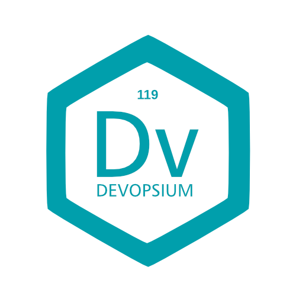

Devopsium
======

Collection of Ansible playbooks to quickly install up to date Linux packages

## Motivation

The packages available in our Distros are not always up to date with the latest and greatest. To install the latest 
version we have to dig deep into Wikis, Docs, Stack Overflow
or some random article/tutorial named "How to install X on [Distro of Choice]".
It is a tiresome and time consuming task.

Devopsium is a collection of Ansible Playbooks that aims to correct this by providing a  standardized way to sync your local repos with the officially maintained by the package creators or the community repositories.

## What is Devopsium?

Devopsium is a small DevOps tool built around Ansible and which syncs
the  officially maintained or most popular community repositories with your 
`yum/repos.d` or `/etc/apt/sources.list.d`. 

Devopsium is heavily inspired by <a href="http://brew.sh">homebrew</a> for 
OSX. 

## Quickstart 

	curl https://raw.githubusercontent.com/martinrusev/edgium/master/install.sh | bash

## Manual Installation

### Install on Ubuntu/Debian

1. **Import the public key used by the package management system.**  
	The Ubuntu package management tools (i.e. dpkg and apt) ensure package consistency and authenticity by requiring that distributors sign packages with GPG keys. Issue the following command to import the [https://packages.amon.cx/amon.key]( Devopsium public GPG Key):

		sudo apt-key adv --keyserver hkp://keyserver.ubuntu.com:80 --recv AD53961F

2. **Create a list file for Devopsium.**  
Create the /etc/apt/sources.list.d/edgium.list list file using the following command:

		echo 'deb http://packages.amon.cx/repo amon contrib' | sudo tee /etc/apt/sources.list.d/edgium.list

3. **Reload local package database and install**  
Issue the following commands:

		sudo apt-get update
		sudo apt-get install edigum

4. **Install Ansible**  
Devopsium uses Ansible playbooks behind the scenes. To install Ansible, check the official docs: 
[http://docs.ansible.com/intro_installation.html#latest-releases-via-apt-ubuntu](http://docs.ansible.com/intro_installation.html#latest-releases-via-apt-ubuntu "check the official docs")

### Install on CentOS/Amazon Linux

1.**Configure the package management system (YUM).**  
Create a /etc/yum.repos.d/edgium.repo file to hold the following configuration information for the Devopsium repository:

	[edgium]
	name=Devopsium Repository
	baseurl=http://packages.amon.cx/rpm/
	gpgcheck=0
	enabled=1
	priority=1

2.**Install the Devopsium packages**.  
To install the latest stable version of Devopsium, issue the following command:

	yum install -y edgium

3.**Install Ansible**  
Devopsium uses Ansible playbooks behind the scenes. To install Ansible, check the official docs: 
[http://docs.ansible.com/intro_installation.html#latest-release-via-yum](http://docs.ansible.com/intro_installation.html#latest-release-via-yum)

## Available playbooks

You can see the whole list of available playbooks here:

[http://martinrusev.github.io/edgium/#packages](http://martinrusev.github.io/edgium/#packages)

## Contributing

So far, Devopsium has been an internal tool, and has been maintained in the little free time available to us. Bugs may appear, and there is a lot of room for improvement.

If you happen to come across a bug, please create an issue providing as much information as possible. If you want to help, fork the project and submit your Pull Requests. All contributions are most welcome.
